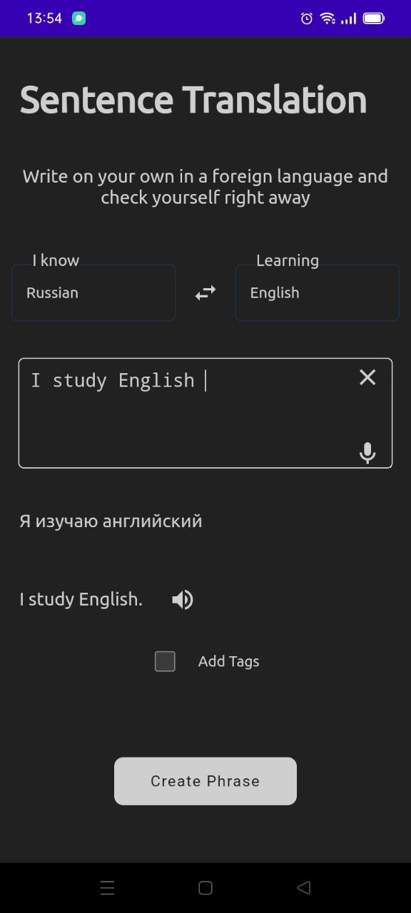
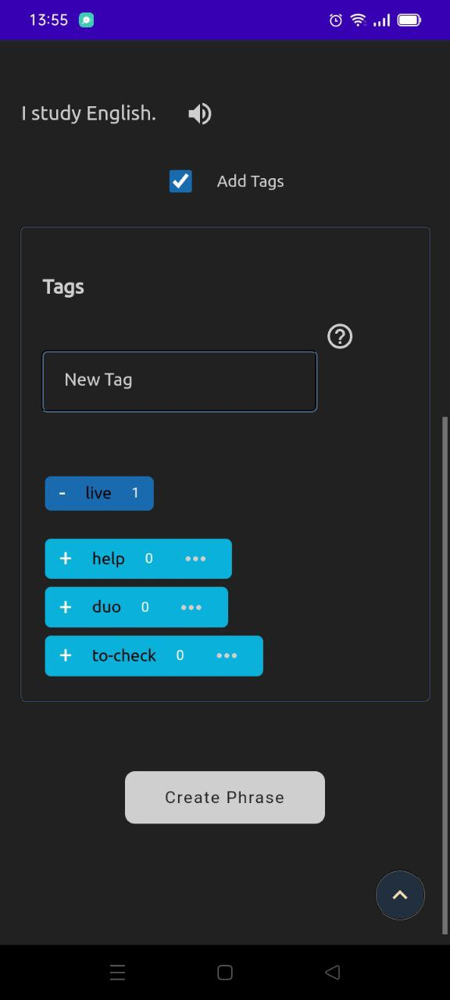
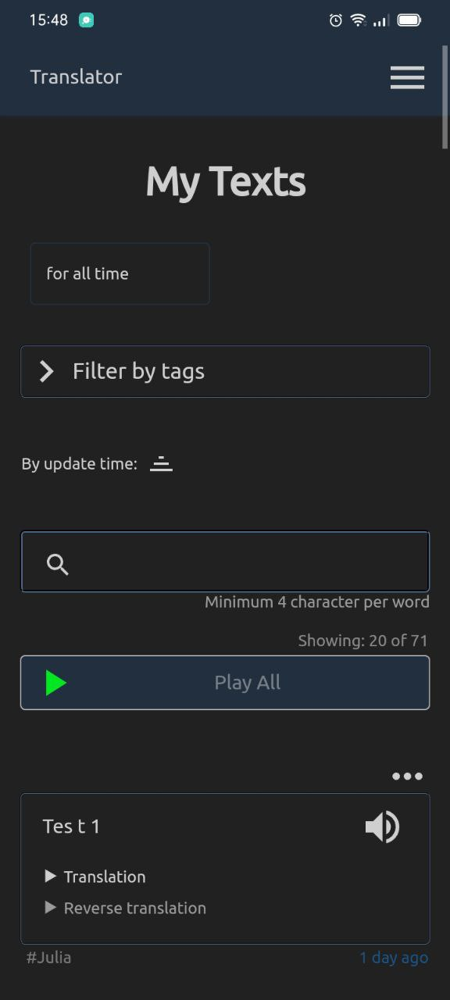
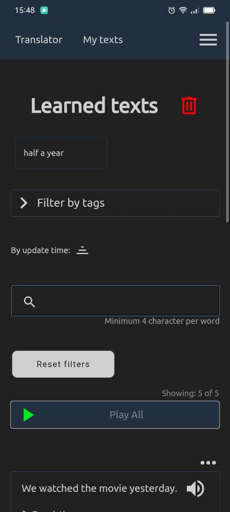

# Ana

Application for easy composing texts in the foreign language.

## Main Features

---

Without sign in

---

- Translation (English, Arabic, Azerbaijani, Catalan, Chinese, Czech, Danish, Dutch, Esperanto, Finnish, French, German, Greek, Hebrew, Hindi, Hungarian, Indonesian, Irish, Italian, Japanese, Korean , Persian, Polish, Portuguese, Russian, Slovak, Spanish, Swedish, Thai, Turkish, Ukrainian.)
- Speech recognize
- Synth speech

---

With sign in

---

- Save, edit, delete own texts
- Create tags and pin they to the text
- Filter saved texts by tags, date, search, learn language
- Sort saved texts by date
- Synth speech of all saved texts

## Screenshots

## Localization

At the moment, two interface languages English and Russian are supported, to add other interface languages, see [docs/contributing/LOCALES.md](docs/contributing/LOCALES.md)

## License

It requires the operator of a network server to provide the source code of the modified version running there to the users of that server.
