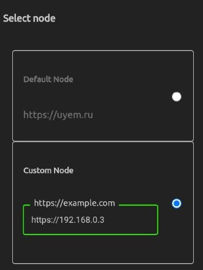

# Instruction for create a custom node in local network

To use your own node, you must first install node on your server or on your computer. To be able to connect within the app to a host running on the local network, the `Ana` app installed on your Android phone must be at least version `1.34`.

_The following is an example of a server installation to run the application server locally on a home computer. For installation on a remote server, these instructions should also work. However, it is assumed that you will be using a non-self-signed certificate on the remote server, so the Nginx settings will be slightly different._

## Requirements

### Settings:

- Computer and phone must be connected to the same network
- Port `443` must not be busy on the computer

### Programms:

```sh
docker-compose @latest
```

**If, for example, you already have a Postgres database installed on your machine and you want to use it, then you need to create your own docker-compose file called `docker-compose.custom.yml` , which imports only the necessary services from _docker-compose.yml_, just like you did in the _docker-compose.ci.yml_ and _docker-compose.dev.yml_ files.**

## Get the code

Clone the repository:

```sh
git clone https://github.com/kolserdav/ana.git
```

Change work directory to ana:

```sh
cd ana
```

## Set up environment variables

You need to create three .env files from .env.example files

1. `.env`

```sh
cp .env.example .env
```

2. `packages/app/.env`

```sh
cp packages/app/.env.example packages/app/.env
```

3. `packages/translate2/.env`

```sh
cp packages/translate2.env.example packages/translate2/.env
```

**Read the comments in these files carefully and adjust the variables according to your network.**

## Start Docker containers

Base container list:

```sh
docker-compose up -d
```

Custom container list:

```sh
docker-compose up -d -f docker-compose.custom.yml
```

Now wait for the `translation` container to load all the language models. See container logs.
Containers `app` and `server` also do not immediately begin to appear on the network, but only after build and launch. Also look at the logs of these containers.

_The `Ana` mobile app, since version `1.34`, also works with a self-signed certificate, but if you want to open the web app on your computer, you will need to manually open the addresses of the app (APP_URL), API server (APP_URL:PORT_SSL), and WS server (APP_URL:WS_PORT_SSL, if yout get WS address form console of browser change `wss` to `https`) in the browser and specify each as trusted._

## Change node in mobile app

- Open App>settings
- Change custom node  
  
- Restart app
