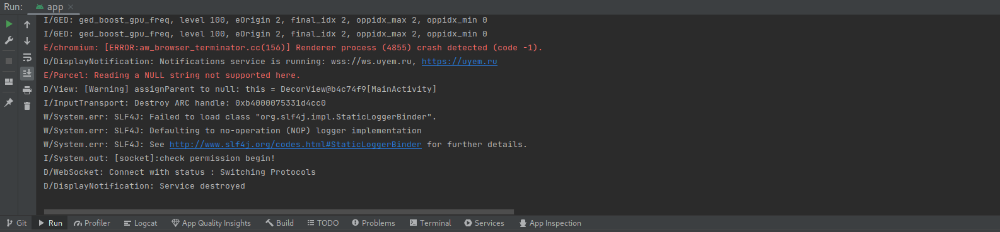

# Debug app with Android Strudio guide

The Android Studio program is used to debug the mobile application. This guide provides step-by-step instructions for debugging the application on your mobile device.

1. Download and Install Android Studio on your OS  
   Official site download link: [https://developer.android.com/studio](https://developer.android.com/studio)
2. Enable USB Debugging Mode on Android  
   For reference see [here](https://www.lifewire.com/enable-usb-debugging-android-4690927)
3. Connect your device to your computer via USB
   Select connection type like: Files / Android Auto
4. Clone the project

```sh
git clone https://github.com/kolserdav/ana.git
```

5. Open Android Studio project  
   Go to `File>Open` and select the `android` directory of Ana project
6. Check that your physical device selected on Navigation Bar
7. Push `Sync Project with Graddle files` button on Navigation Bar  
     
   The program will install the dependencies and build the project. It can take some time.
8. Push `Run 'app'` button on Navigation Bar  
     
    Turn on the device display and wait for the app to launch on your device.  
    **If a production version of the application is already installed on the device, then it must first be removed. Since the development version of the application has the same name, but their signatures are different.**

Once the app is running on the device, after that in Android Studio you can see the debug information for the app.


